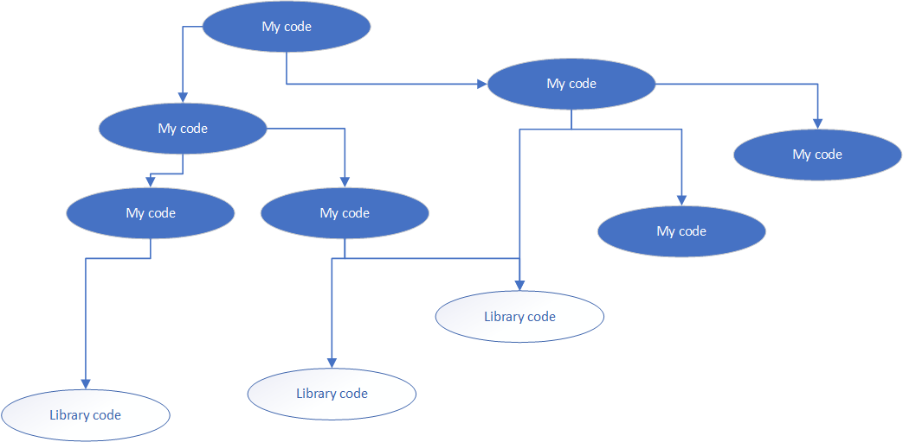
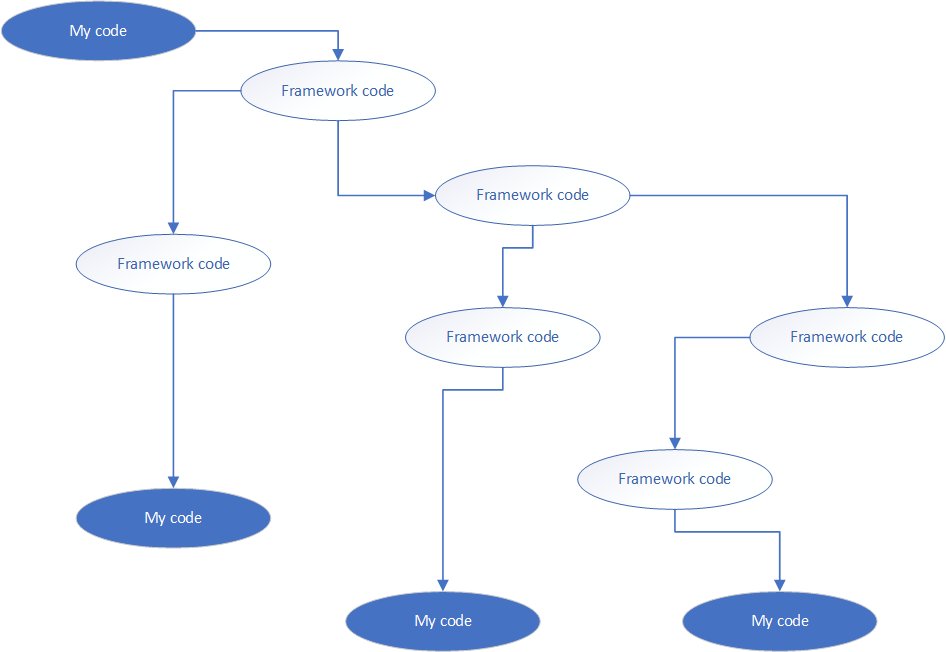

# The Walking Skeleton

A "walking skeleton" does nothing, but it does nothing in a useful way. The
skeleton puts all the pieces in place, with calls that go from end to end, even
though it delivers no real functionality. The bones of the skeleton give us a
place to begin building functionality, while staying continuously integrated and
deployable.

In previous eras, a walking skeleton was permitted to perambulate your dev box.
These days, I prefer to also include a build pipeline and deployment. The
metaphor gets a bit strained, since we have a walking skeleton of our delivery
pipeline that deploys a walking skeleton of the production environment. Maybe I
should say the "anemic necromancer" raises the walking skeleton into production.
On the other hand, development is production, so I'll just call the whole thing
the walking skeleton.

A potential downside of the walking skeleton is that we risk front-loading
decisions that we don't yet need to make. Tomorrow we will know more about this
project than we do today. That means today is the most ignorant I will ever be
about this decision. Put that way, procrastination sounds like the smart
approach! Sadly, while procrastination helps us avoid making ignorant decisions,
it doesn't help us reduce that ignorance. We must decide, act, and reflect to
learn what the original decision should have been.

Faced with this paradox, I choose to make decisions with an eye toward
minimizing the cost of being wrong. That is, I would like to make the cost of
changing or reversing one of these decisions bearable.

## Make descisions orthogonal, not contingent

A contingent decision is one which is contrained by earlier choices. For
example, if we chose to use "company" as the entity to represent a
confidentiality boundary, then decisions about how to represent multiple related
systems within a company are constrained.(Either we lump everything into one
"company" or we create an idea of "friend" interfaces between companies.)

In this case, I don't want to unnecessarily couple decisions about the test
tools to deployment tools, or deployment to the target platform. There may be
places where I choose to relax this rule, but only when the gain is large enough
to offset future restrictions.

Unfortunately, many of the tools out there bring their own contingent decisions
along with them. For instance, it would make zero sense to use AWS
CloudFormation to build environments in Azure. If you treat it purely as a
technical challenge, like writing the Game of Life in Mondrian, I'm sure you can
find a way to run enough scripts and SSH to make it work, but you're really not
going with the grain of the tool. But that's what I mean by a contingent
decision: picking CloudFormation as a deployment tool makes some further choices
easy and others will be hard or impossible.

Contingent decisions drastically increase the cost of changing a decision. "But
if we do X, then we also have to do Y and Z," is the sound of a contingent
decision exploding your cost of change. It feels like pulling one thread only to
find that you're dragging a bunch of anchors along behind you.

## Observe the Spectrum of Change

As designers and developers, we make decisions about what to embody as
architecture, code, and data based on known requirements and our experience and
intuition.

We pick some kinds of changes and say they are so likely that we should
represent the current choice as data in the system. For instance, who are the
users? You can imagine a system where the user base is so fixed that there's no
data representing the user or users. Consider a single-user application like a
word processor before the web. Today, a word processor keeps data to represent
the user for various collaboration features.

Another system might implicitly indicate there is just one community of users.
So there's no data that represents an organization of users... the organization
is implicit. On the other hand, if you're building a SaaS system, you expect
whole communities of users to come and go. (Hopefully, more come than go!) So
you make a community into data because you expect them to change rapidly.

If you are build a SaaS system for a small, fixed market you might decide that
the population won't change very often. In that case, you might represent a
population of users in the architecture via instancing. (Though I must also
caution that every "instanced" company I've seen has eventually made a huge
effort to reach true multitenancy, almost always due to the high operating cost
of instancing.)

So data is at the high-energy end of the spectrum, where we expect constant
change. Next would be decisions that are contemplated in code but only made
concrete in configuration. These aren't quite as easy to change as data.
Furthermore, we expect that only one answer to any given configuration choice is
operative at a time. That's in contrast to data where there can be multiple
choices active simultaneously.

Below configuration are decisions represented explicitly in code. Constructs
like policy objects, strategy patterns, and plugins all indicate our belief that
the answer to a particular decision will change rapidly. We know it is likely to
change, so we localize the current answer to a single class or function. This is
the origin of the "Single Responsibility Principle."

Farther down the spectrum, we have cross-cutting behavior in a single system.
Logging, authentication, and persistence are the typical examples here. Would it
be meaningful to say push these up into a higher level like configuration? What
about data?

Then we have those things which are so implicit to the service or application
that they aren't even represented. Everybody has a story about when they had to
make one of these explicit for the first time. It may be adding a native app to
a Web architecture, or going from single-currency, single-language to
multinational.

Next we run into things that we expect to change very rarely. These are
cross-cutting behavior across multiple systems. Authentication services and
schemas often land at this level.

The farther toward the "red" end of the spectrum we push a concern, the more
tectonic it will be to change it.

No particular decision falls naturally at one level or another. We just have
experience and intuition about which kinds of changes happen with greatest
frequency. That intuition isn't always right.

If we make an effort to turn everything into data, we will arrive at rules
engines and logic programming. That doesn't usually end up with the end-user
control we think. It turns out we need programmers to think through changes to
rules in a rules engine because thinking in that way is kind of what makes a
programmer. Instead of democratizing the changes, we would have made them even
more esoteric!

The most decisions we energy-boost to that level, the more it costs. And at some
point you generalize enough that all you've done is create a new programming
language. If everything about your application is data, you've written an
interpreter and recursed one level higher. Now you still have to decide how to
encode everything in that new language.

With these two maxims in mind, it's time to make some choices about where this
will live and how to build it.

## Documenting Architecture Decisions

A certain wise man once sang "If you choose not to decide, you still have made a
choice." Behind that choice is a lot of context. When you decide (or choose not
to decide) you have all kinds of context in your head: the current state of the
system, the company, skills present in your team, roadblocks in the
organization, details of technologies in use and under consideration, and so on.
A decision which is right for your situation may look strange or even wrong to
people later or who lack your current understanding. On the other hand, you
might have only some of the facts and later information may cause you to
re-evaluate a choice.

The reasoning behind a decision is important and I've found it useful to
document the decision itself, in a format called an "Architecture Decision
Record" or ADR. An ADR consists of 4 parts:

1. The current context.
2. The decision made in that context.
3. The consequences of that decision.
4. The status of the decision itself. (Proposed, accepted, superceded,
   rejected.)

Save the persuasive writing for English classes and project pitches. Each part
here states a series of facts. Bullets are fine, but try to use active voice
sentences so readers know who is doing what. (That's especially important in the
decision section.)

Once proposed, an ADR can be changed which a team discusses and makes the actual
decision. After that, however, it should stay the same. It may get out of date
with respect to the system, but we fully expect that. In fact, future decisions
might alter or reverse part of an old decision. It's totally normal to see an
ADR about adding a framework, followed some time later by another ADR about
removing the very same framework. By recording the decisions, future team
members can catch up on years of evolution in an hour or two. The old ADRs will
explain something that the "as-built" documentation can't: *why* the system
looks the way it does.

A system that has evolved over time won't look like it would with a clean-sheet
rewrite. That's OK! A "lived-in" look can be cozy and familiar. I describe it as
a system that shows its history. *Here* is the spot where we cut out that
framework, but you can still see a wrapping interface we used. Over *there* is
where the old GUI technology connected to the domain layer. That's why we have
all these domain objects with the visitor pattern. (And by the way, you should
read ADR 32, about removing the vestiges of the visitor.)

Some projects even record their decision to use architecture decision records.
It's like bootstrapping via ADR 1. ADR 1 explains what an ADR is, frequently
with a link to my [original blog
post](http://thinkrelevance.com/blog/2011/11/15/documenting-architecture-decisions)
about the technique. This meta-ADR serves the same purpose as the regular ones.
When someone who wasn't part of the original decision wants to understand the
project, they can read ADR 1 to learn the technique and why the team chose to
adopt it.

I'm using [Nat Pryce's](https://github.com/npryce)
[adr-tools](https://github.com/npryce/adr-tools) automation to keep my format
consistent, which gives us ADR 1 as soon as we run `adr init`. It's visible in
the source repository for the real system, but I'm also including it here in the
book for clarity and ease of reading.

> ## 1. Record architecture decisions
> 
> Date: 2019-02-22
> 
> ### Status
> 
> Accepted
> 
> ### Context
> 
> We need to record the architectural decisions made on this project.
> 
> ### Decision
> 
> We will use Architecture Decision Records, as [described by Michael Nygard](http://thinkrelevance.com/blog/2011/11/15/documenting-architecture-decisions).
> 
> ### Consequences
> 
> See Michael Nygard's article, linked above. For a lightweight ADR toolset, see Nat Pryce's [adr-tools](https://github.com/npryce/adr-tools).

### Infrastructure and Superstructure

Where will this system run? How shall we build it? Where do we want to land on
the spectrum from infrastructure to platform? It's time to make some decisions.
I may regret some of these later, but let's get started and see what needs to be
modified later.

> ## 2. Use AWS
> 
> Date: 2019-02-22
> 
> ### Status
> 
> Accepted
> 
> ### Context
> 
> The system should be available from multiple devices, with the same record of facts.
> 
> A desktop application would require some kind of synchronization via files, perhaps in Dropbox, OneDrive, GDrive, or the like. File locking and version conflicts are a concern.
> 
> A web application with a database handles the synchronization. However, a web application requires some place to run. In 2019, we can assume use of a cloud platform, but must decide which one to use.
> 
> The development team knows AWS the best. This could be a motive to pick Azure or GCP, if the dev team's learning is an objective.
> 
> This system will have a small number of users and operate at low scale. Requests will be very intermittent.
> 
> The operator would like to keep the monthly cost footprint down.
> 
> Cloud providers offer proprietary services with non-standard APIs. These can supply a lot of functionality, at the expense of lock-in on those services.
> 
> Embracing vendor services results in a large number of contingent decisions.
> 
> Wrapping vendor services is costly to implement and results in "lowest common denominator" functionality.
> 
> ### Decision
> 
> We will build the system on AWS.
> 
> Furthermore, we will embrace vendor services without attempting to wrap them or isolate ourselves from them.
> 
> ### Consequences
> 
> The dev team won't learn a new cloud platform.
> 
> The reader will learn how to build a complete system with AWS.
> 
> We will need to choose which AWS compute, storage, and networking services to use. Some of these choices will have serious cost implications.
> 
> We have the option to use AWS Cognito for user management and access control.
> 
> Build and deployment tools have excellent support for AWS, so we expect to have greater options with those.

So now that we have the "where" identified, we also need to talk about "what"
and "how"

> ## 3. Rich front end with API
> 
> Date: 2019-02-22
> 
> ### Status
> 
> Accepted
> 
> ### Context
> 
> We need to define the basic architecture of the system.
> 
> The GUI must be responsive. This implies at least some asynchronous behavior on the page, and probably means optimistic GUI updates.
> 
> Server-side page rendering for form submission is slow and *deeply* unfashionable now.
> 
> Excellent tools exist to define and implement HTTP based APIs.
> 
> ### Decision
> 
> We will build the system as a back end API server with a rich front end. It may or may not be a single-page app, but page loads should be minimized in the important flows (i.e., when capturing information.)
> 
> We will create source modules that match this structure:
> 
> 1. `api` for the back end service
> 2. `ui` for the front end code
> 
> ### Consequences
> 
> We have an enormous array of frameworks and libraries to choose from. No matter what we pick, at least one person will think it's the dumbest choice in the world.
> 
> We must also decide how information will be passed between the front and back ends.
> 
> We have an open question about how to serve static assets and where they should live in the source tree.
> 
> We have an open question about testing, specifically how much integration testing is required.

> ## 4. Clojure and ClojureScript
> 
> Date: 2019-02-22
> 
> ### Status
> 
> Accepted
> 
> ### Context
> 
> Viable choices for back end implementation language, based on the dev team's skills include:
> 
> - Ruby (with Rails, naturally)
> - Go
> - Python
> - Rust
> - Java
> - Scala
> - Clojure
> - Elixir
> 
>  Candidate choices for the front end include:
> 
> - ClojureScript
> - Typescript
> - Elm
> 
> The dev team has little experience with vanilla Javascript.
> 
> Virtually any combination of these languages can implement the constructs of ADR 3.
> 
> Any choice of languages will be unfamiliar to some readers, though some choices will be more foreign than others.
> 
> The dev team's most recent experience is with Clojure and ClojureScript.
> 
> ### Decision
> 
> We will use Clojure for the API, and ClojureScript for the UI.
> 
> ### Consequences
> 
> Code will require more explanatory text due to the unfamiliar syntax.
> 
> Where possible, we can use isomorphic code between back-end and front-end.

## Front to Back

Let's start with the front end of the walking skeleton. (Mixing these metaphors
creates some very odd imagery!) It will be a ClojureScript application, per ADR
\4. Like every other front end language, ClojureScript compiles into JavaScript.
It plays reasonably well with the NPM ecosystem, so we can take advantage of the
many packages that exist out there. Right up front, though, I have to say that
my personal practice is to be parsimonious with dependencies. I like to keep my
dependency tree narrow and shallow. In part, that comes from a history of
frustration with [dependency
breakage](https://www.theregister.co.uk/2016/03/23/npm_left_pad_chaos/) in a
deep tree. The probability that a breaking change appears somewhere in the span
of my dependencies seems to go up much faster than linearly with the number of
libraries I use. Even without breaking changes, we've also seen untrustworthy
maintainers become a
[problem](https://github.com/dominictarr/event-stream/issues/116).

So there will certainly be times that I add code to my application in order to
avoid adding a library. That even extends to copy-and-paste from open source
libraries, if the part I need is small and the library is large.

Despite that, it would be foolhardy to eschew the millions of lines of code that
I can integrate with a simple `yarn add` command. There is a serious tension
here between the desire to go faster now by adding libraries versus the desire
to _keep_ going faster later by avoiding them. It's a kind of trade-off that we
don't talk about often enough. I don't have a hard and fast rule to offer.
Instead, each library is its own case. My decision on each one will hinge on a
few factors:

1. How much value do I get from the module? Note that this is not asking how
   much it offers, but how much I will use. A large module from which
   I use only one function is a big burden in future cost.
2. Is it well encapsulated? How much does it distort my application? For
   example, can I simply add an attribute to an element to get "copy to
   clipboard?" If so, then there's very little distortion to my application. On
   the other hand, some modules are frameworks rather than libraries.
3. How well do I understand the module? I am not an expert in JavaScript so
   there's a cost to digging through the module's code. (Naturally, there's a
   benefit too... after all, digging through code is how one _becomes_ an
   expert!) I need to balance the cost of grokking one module versus an
   alternative. Fortunately for me, the Node ecosystem is vast enough that
   almost every module has an alternative or three.

What's the difference between a library and a framework? A library is something
that my code calls, but my code is still in control of the overall flow, as
shown in figure 1. A framework is something that I may start up, but then it
takes over the control flow and calls my code. With a framework, my code is at
the leaves of the call tree, as in figure 2.





Typical of human language, the edges of the two concepts blur into each other.
There are libraries that use callbacks, and frameworks that have library
functions to call. We apply the terms based on how the most important
interactions flow.

For this application, I've picked a framework that will be the basis for
everything in the front end.

### Framing the Front End

Lately, I've been working with a ClojureScript framework called
[Re-frame](https://github.com/Day8/re-frame). Re-frame is a framework that
provides an out-of-the-box architecture for an SPA.

An out-of-the-box architecture is where the framework itself makes important
decisions about the components you will build and their expected patterns of
interaction. Probably the most famous out-of-the-box architecture is Ruby on
Rails. When you sit down with the source to a Rails project, you already know
where to find the source code, visual assets, how to run tests, how to set up
the database, and so on. You know how to run that application. And when you do
run the application, you know what components to expect (controllers, models,
helpers, views, and view fragments) and how they get called.

At Relevance, when it was a Rails shop, developers could rotate from project to
project on a daily basis, because each project had enough in common that you
could be "not dangerous" right away. Individual projects may deviate from the
out-of-the-box architecture, but that means you just need to learn the deltas
rather than a whole new architecture from scratch.

Likewise, when building on an out-of-the-box architecture, many of your early
decisions about code structure and runtime interactions have ready defaults. You
can choose to deviate later when you know more, but the early structure allows
you to get moving so you _can_ learn where the app needs to deviate.

Re-frame builds on top of [React](http://reactjs.org) and uses the "shadow DOM"
it provides. A Re-frame application follows an event loop that almost looks like
a game engine:

1. Dispatch events
2. Invoke event handlers, passing each the current state of the world. Each
   event handler returns a map of "effects" that it wants to be applied to the
   world.
3. Invoke effect handlers, passing each the effects declared by the event
   handlers.
4. Query the application state, according to subscriptions from views.
5. Invoke view functions to return components and data.
6. Render the components into the shadow DOM.

The main parts we write are the event handlers, effect handlers, queries,
and views. That's what makes Re-frame a framework. It owns the flow of control
and our code plugs in at the leaves of the call tree.

Something that takes a bit of getting used to in Re-frame applications: most of
what we write are pure functions. Take the event handlers for example. They
don't really _do_ anything. As pure functions, they just take in data and return
data, but they don't have any side effects. In most application frameworks your
event handlers are the main engine of change. Not in Re-frame. Here the event
handlers specify in data what some other functions will apply to the world
later.

For example, suppose my UI has a button that says "log in." In the good old days
of vanilla JavaScript, you might put an `onClick` handler on that button that
does an XHR directly to the back end. Easy enough to code, but hard to test,
hard to deal with asynchrony, and hard to keep track of logic and constraints.
In a Re-frame app, we might do this:

``` clojure
[:button.btn-default {:on-click (fn [event] (re-frame/dispatch [:begin-login])}]
```

We'll deal with most of the syntax later. For now, just notice that we attach a
function to the `onClick` event which just asks Re-frame to dispatch an
application-level event.

Somewhere, we had better say how to handle such an event. That would look
something like this:

``` clojure
(re-frame/reg-event-db :begin-login                     ;; 1
  (fn [current-db event]                                ;; 2
    (let [new-db (assoc current-db :logging-in? true)]  ;; 3
      new-db))                                          ;; 4
```

There's a lot packed into those five lines of code, so let's look at it step by step.

Line 1 tells Re-frame that we are registering an event handler, and that it will
return a new database value.

Line 2 provides the second argument to `reg-event-db` which has to be a
function. So we define a function right here inline. It takes the current
"database" and the event. The application database is the current "state of the
world." It's not a database in the RDBMS or NoSQL sense. It's just an in-memory
value that keeps track of my application's state. Most of the time, we use a map
for this database.

In fact, line 3 create a new map by associating (pronounced like "a sosh" not "a
sock") a key `:logging-in?` with the value `true`. In ClojureScript, like in
Clojure, data structures such as maps are immutable. Instead of changing a map
in place, we make a copy of the old map with some changes incorporated.

Line 4 returns the new map.

Taken together, it means that whenever Re-frame dispatches the `:begin-login`
event, we set a flag in the application state to say that we're attempting to
login. The view layer might use that information to show a spinner or disable
some other buttons.

Well, so far with this trivial example, it might seem like jumping through a lot
of hoops to accomplish something as basic as setting a flag. The real value
shows through with more complicated interactions. Because each handler is a pure
function, I can call them directly with my own arguments (the framework doesn't
have to be involved) for tests or exploration. Further, I can use tooling to
look at all the events that were dispatched and see what the database looked
like both before and after the event. Finally, I can make the view layer a
derivative of the database which removes a lot of the weird corner cases that we
can otherwise get into.

By the way, I wrote that example code in a verbose way to help separate concepts
into lines. In a real application, I might do it more like this:

``` clojure
(re-frame/reg-event-db :begin-login             ;; 1
  (fn [db _]                                    ;; 2
    (assoc db :logging-in? true)))              ;; 3
```

The underscore `_` on line 2 is a legitmate identifier in ClojureScript and
Clojure, but by convention it means "I'm not going to use this value." Also,
notice that I'm no longer using a `let` to bind the new database value to a
name... I just return it directly by having it be the last form in the function.

### Compression versus Comprehension

My purpose here is not compression for its own sake, nor am I trying to play
code golf. My objective is to get rid of boilerplate and cruft so one glance at
the code tells me what it does. I'm trying to optimize for code reading rather
than code writing. There is definitely such a thing as going too far though. For
example, I could write the same event handler like this:

``` clojure
(defn s! [k] (fn [v & _] (assoc v k true)))

;; a hundred lines away ...

(re-frame/reg-event-db :begin-login
  (s! :logging-in?))
```

(If you're interested, the `s!` function returns another function which will
later associate `true` to the key that was given to `s!` in a database that is
given to the returned function. Yes, that did take me three times as many
characters to explain as to code!)

I would say that this version is over-compressed. The function `s!` is a fairly
trivial composition of basic language features. Once you've learned Clojure, the
phrase `(assoc db :logging-in? true)` is a natural chunk of meaning and it reads
the same in any Clojure program. To decipher `s!` I need to remember it has a
local, application-specific meaning. If I don't remember it, and `s!` is not
visible when I look at `:begin-login`, then I need to navigate to it and
navigate back to comprehend what I see. The mental overhead of that recall or
navigation is not worth the characters saved.

### Side Effects, Sadly Necessary

So far, the event handler we wrote only sets a flag in our local database. Most
of the time an action like "log in" requires some extra interaction with the
world. Suppose we need to invoke a back end API function for authentication. The
event handler _still_ doesn't directly do that invocation. Instead, it returns
an effect map with additional effects specified. Re-frame will find an
appropriate effect handler to invoke---or complain that no such effect exists,
of course.

Here's how an event handler for the `:begin-login` event might look:

``` clojure
(re-frame/reg-event-fx :begin-login             ;; 1
  (fn [cofx _]                                  ;; 2
     {:db (assoc (:db cofx) :logging-in? true)  ;; 3
      :http {:method :post                      ;; 4
             :url "/api/v1/auth"                ;; 5
             :on-success [:login-succeeded]     ;; 6
             :on-failure [:login-failed]}}))    ;; 7
```

Before we dive into the details of this function, notice two things. First, we
didn't change the `:on-click` function in the view at all. We get that
decoupling as a benefit of Re-frame's model.

Second, there's a subtle change on line 1. Instead of calling `reg-event-db`,
we're calling `reg-event-fx`. The difference has tripped me up more than once.
`reg-event-db` registers an event handler that Re-frame will call with the
current database and whose return value becomes the new database. But it turns
out that `reg-event-db` is a convenience function. The more general version is
`reg-event-fx`, which calls the event handler with a "coeffects map" and which
returns an "effects map."

For the moment, let's just think of the coeffects map as "everything the event
handler needs to know about" and we won't worry about whose job it is to provide
that map.

The effects map that we return allows one event handler to specify multiple
effects. Each key represents a different type of effect, and Re-frame uses those
keys to locate the correct effect handler to call.

On line 3, you can see that one of the effects we ask for is to update the
database. The effect handler for `:db` directly takes the value from that key
and splats it into the application database atom. (You might already be able to
picture how `reg-event-db` works... it creates a wrapper function that calls
your event handler then constructs a map with the `:db` and your function's
return value.)

Line 4 starts a new effect specification, for an effect handler called `:http`.
That one doesn't come with Re-frame. It's something we will implement. The value
of that effect is a map with some keys that we could use to issue an XHR.

A Re-frame application will define a handful of effect handlers. Each one of
defines its own micro-DSL for how the effect should be specified.


## Assembling the Bones

Front end development can be wonderful once you have a working build. Change a
line of code and see its effect in milliseconds with hot reloading. Use the
developer console to run snippets of code inside your environment. But getting that build working sometimes feels like doing a jigsaw puzzle without the picture on the box. Add in a transpiled language (or two!) and it can get positively maddening.

I will try to keep the build as simple as possible. It starts with [Shadow-cljs](http://shadow-cljs.org/), which compiles ClojureScript, manages the CLJS dependencies, and does hot code reloading. It looks for a file called `shadow-cljs.edn`. "EDN" is short for Extensible Data Notation, which is a human-readable data serialization format. Think of it like JSON with better type preservation. EDN is commonly used in the Clojure ecosystem because it can be both read and emitted with just the core library.

``` clojure
{:source-paths ["src"]
 :dependencies [[reagent "0.8.1"]
                [re-frame "0.10.6"]
                [binaryage/devtools "0.9.10"]
                [thheller/shadow-cljsjs "0.0.16"]
                [day8.re-frame/http-fx "0.1.6"]
                [day8.re-frame/re-frame-10x "0.3.7-react16"]
                [day8.re-frame/tracing "0.5.1"]]
 :dev-http     {8080 {:root      "target/"
                      :proxy-url "http://localhost:3000"}}
 :builds       {:app {:output-dir       "target/"
                      :asset-path       "."
                      :target           :browser
                      :modules          {:main {:init-fn igles.main/init}}
                      :compiler-options {:closure-defines {"goog.DEBUG"                                 true
                                                           "re_frame.trace.trace_enabled_QMARK_"        true
                                                           "day8.re_frame.tracing.trace_enabled_QMARK_" true}}
                      :devtools         {:preloads   [day8.re-frame-10x.preload
                                                      devtools.preload]
                                         :after-load igles.main/reload!}}}}
```

The dependencies on lines 2 through 8 are expresssed in a shorthand notation for Maven coordinates. In `shadow-cljs.edn` these are just little 2-vectors with a symbol as the first element and a string as the second. You could read this file into any other tool and manipulate its contents. It's just data. Shadow-cljs itself interprets the symbol by mapping the namespace (the part before the slash) as the Maven group ID and the part after the slash as the Maven artifact ID. The string identifies the version. Dependencies that don't have a namespace mean the group ID is the same as the artifact ID.

We won't worry too much about the `:builds` section for now. Mostly we note that the output files go under `target`, which is also the root that our dev server can vend from. Also, we are targeting a browser for the build. Shadow-cljs can target Node for back end work as well.

Under `:dev-http` we also see `:proxy-url`. This allows the front end code to make XHR calls to the same origin, and the dev server will transparently proxy through to a different server. This lets us mimic the deployment configuration a bit more closely, where we would have a single origin via a load balancer or other reverse proxy.

`shadow-cljs watch app` will let us build the Clojurescript code with hot reloading. But we're still missing some pieces. Namely, we need an HTML file to load the app along with non-Clojurescript dependencies.

I'm going to use Yarn to manage NPM packages and assemble things under `target`. The `package.json` file for that looks like this:


```
{
  "name": "growing-one-system-fe",
  "version": "1.0.0",
  "description": "",
  "main": "index.js",
  "scripts": {
    "watch": "shadow-cljs watch app",
    "compile": "shadow-cljs compile app",
    "release": "shadow-cljs release app",
    "html": "mkdir -p target && cp assets/index.html target/",
    "serve": "yarn html && http-server target/",
    "del": "rm -r target/*",
    "build": "yarn release && yarn html && yarn serve"
  },
  "author": "",
  "license": "EPL-2.0",
  "devDependencies": {
    "highlight.js": "^9.15.6",
    "http-server": "^0.11.1",
    "react-flip-move": "^3.0.3",
    "react-highlight.js": "^1.0.7",
    "shadow-cljs": "^2.8.0"
  },
  "dependencies": {
    "create-react-class": "^15.6.3",
    "react": "^16.8.5",
    "react-dom": "^16.8.5"
  }
}
```

Notice that the dependencies mainly revolve around React. Clojurescript doesn't know anything about React by itself. In order to make React visible within the Clojurescript code we do a little dance of assembly and loading.

1. Use Yarn to install the packages under `node_modules`
2. Use Yarn to copy our HTML source page (more about that in a minute) to `target`
3. Use Shadow-cljs to compile the CLJS code to Javascript.
4. The CLJS compiler uses Google Closure to bundle (and optionally minify) the generated code.

Sometimes our HTML page will also need to directly load JS files to make them available for Clojurescript. In this case, Re-frame uses Reagent, which knows to load React so we don't have to do it by hand.

Our HTML file looks like this:

```
<body>
<div id="app"/>
<script>var CLOSURE_UNCOMPILED_DEFINES = {"re_frame.trace.trace_enabled_QMARK_": true};</script>
<script src="main.js" type="text/javascript"></script>
<script>window.onload = function () { igles.main.init(); }</script>
</body>
```

Pretty simple. When our app initializes, it will rewrite the contents of the `app` div with our UI. The bit about `CLOSURE_UNCOMPILED_DEFINES` just lets us use Re-frame's debugging tools. We'll remove that later.

